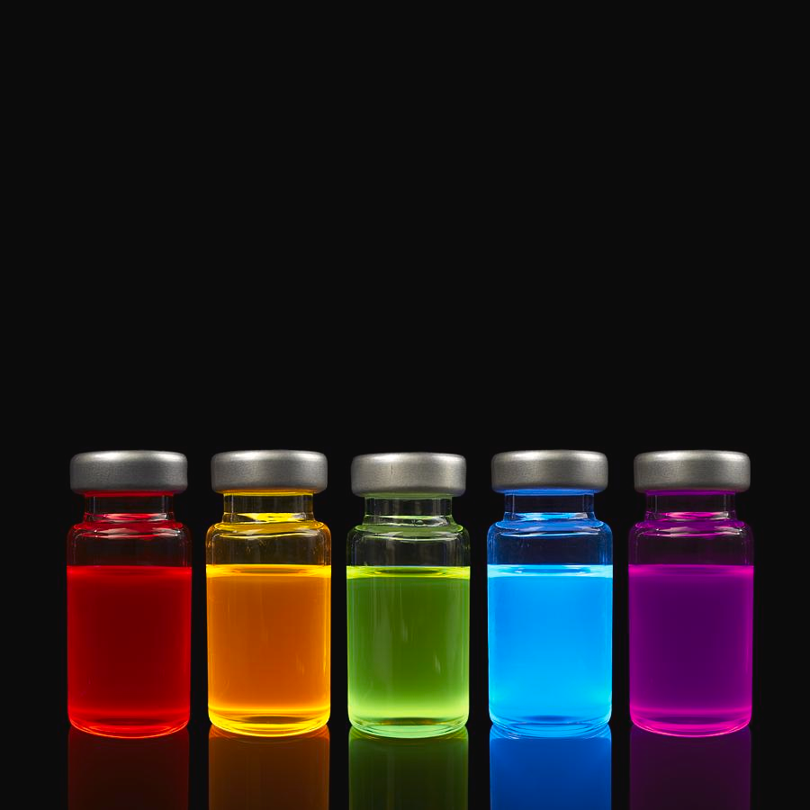

# Quantum Dots Simulation

This project is a Python script that simulates a quantum dot system and visualizes the probabilities of the system being in different energy levels over time. It uses the QuTiP library for quantum mechanics and quantum information science, NumPy for numerical computations, and Plotly for creating interactive plots.

## Quantum Dots

Quantum dots are tiny particles or nano crystals of a semiconducting material with diameters in the range of 2-10 nanometers (10-50 atoms). They exhibit quantum mechanical properties due to their small size. One of the most notable properties of quantum dots is their color. When illuminated, they can emit light of various colors. The color of that light depends on the size of the quantum dot. Larger dots emit light at the red end of the spectrum, while smaller dots emit light at the blue end.

## Code Explanation

The code consists of two main functions: `calculate_probabilities` and `create_plot`.

### calculate_probabilities

This function calculates the probabilities of the energy levels of a quantum dot system. It takes two parameters: `N`, the number of energy levels in the quantum dot system, and `tlist`, the time range and steps for the simulation.

The function first checks if `N` is a positive integer. Then, it defines the Hamiltonian of the quantum dot and the initial state of the quantum dot. The Schrödinger equation is solved using the `sesolve` function from QuTiP, and a 3D array is created to store the probabilities at each time step. The probabilities are calculated for each time step by taking the absolute square of the state vector at that time step.

### create_plot

This function creates a 3D surface plot of the probabilities. It takes one parameter: `probabilities`, the 3D array of probabilities calculated by the `calculate_probabilities` function.

The function creates a Plotly Figure with a Surface trace, showing the probabilities. The color scale of the surface plot is shown, and the plot is titled "Quantum Dot". The x, y, and z axes are labeled "Energy Level", "Energy Level", and "Probability", respectively. The plot is displayed using the `fig.show()` function.

## Usage

To use this script, first define the number of energy levels `N` and the time range and steps `tlist`. Then, call the `calculate_probabilities` function with `N` and `tlist` as arguments to calculate the probabilities. Finally, call the `create_plot` function with the calculated probabilities as an argument to create and display the plot.

```python
# Define the number of energy levels
N = 5

# Define the time range and steps
tlist = np.linspace(0, 20, 200)  # time range extended to 20

# Calculate the probabilities
probabilities = calculate_probabilities(N, tlist)

# Create the plot
create_plot(probabilities)
```
```bash
# run the script
python quantum_dots.py
```

This will create a 3D surface plot of the probabilities of the energy levels of a quantum dot system with 5 energy levels over a time range from 0 to 20.


